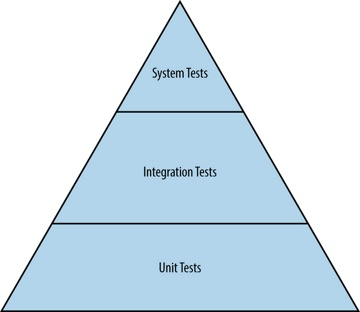

# System Test Automation
## Fundamentals

---

## What is it?

Note:
Automated checking that things that were previously known to be true still are.

As opposed to _testing_ activities, which look to surface new information about the system.

A replacement for manual regression checking. 

_Not_ a replacement for integration or unit tests.
---

## Why would we do it?

Note:
A low execution-cost way to gather information about the current health of the build, from a users perspective

Properly built and maintained test automation helps you to change with confidence, and so change at speed.

All test automation aims to enable change with confidence and speed.  

At a system level, we're primarily aiming to cover regression risks introduced to the wider system (specifically at the user/consumer interface) by changes in its subcomponents.
---
## Context: Test Pyramid

Note:
The test pyramid is a model often used/abused to describe very different things roughly related to testing.

The most useful way to think of it is to see it as illustrating the competing dimensions of isolation and system-confidence.

Isolation (in the code under test) is proportional to system (and therefore test) determinism and the speed of execution.

However, isolation is _inversely_ proportional to the system confidence provided by the resulting information.

Touch on: Vocab: Integration testing in the large/small

Q: How does this relate to API testing?

Q: What’s the difference between system and acceptance testing?

---
## What tests should be written?

Note:
As few as possible _to cover the risks we care about_

Write tests at the lowest possible point in the pyramid

E.g. Checking a validation message appears is a UI unit test.

Checking that the post-validation transition occurs is likely a system test.

Anti-pattern: _Test all the things!_
---
## When should we write system tests?

When the interface is stable.

When supporting test strata are in place.

Note:
UI churn is common early in development and should be taken into account when considering when to write tests.

Anti-pattern: Ice cream cone

---

#### Fundamental Principles: Implementation priorities

## Stability > Performance > Coverage

Note:

High coverage but poor performance results in tests that aren't ran as they take too long.

High performance but poor stability results in tests that aren't ran as they're too expensive to extract information from.

In a nutshell: It's better to have one stable and performant test, than many tests that are slow and / or unstable.

Anti-pattern: Maximising test counts/coverage, e.g. in migration projects.
---

#### Fundamental Principles : Measuring health

## Signal : Noise

Note: 
Common anti-pattern: Test counts, Pass/Fail counts

There is only one relevant measure of health in an STA effort.  Signal:Noise.

What % of test results accurately gave the information they intended to

Difficult to measure - a manual/qualitative activity

But worth doing

Goal should be S:N of 99%+

---
## Workflow
  - Capturing scenarios
  - Building the abstraction
  - Proving code
  - Proving compatibility
  - Proving stability
  - Local execution vs Remote execution

Q: How do you increase/improve stability?

Q: How to you increase/improve performance?

Q: How to you increase/improve coverage?
---
# THE END

### Content that follows is to help with common questions

---
## Design pattern/s

Basic 3 layer
 - Test specification 
 - User behavior 
 - System abstraction 

Q: What about BDD/Tools?

---
## Common pitfalls
  - Degradation
    - Quarantine process
  - Silo’d ownership
    - Documentation and education
  - Over reliance
    - Mature and transparent test approach
  - Over engineering
    - KISS, YAGNI

---
## Webdriver Overview

Selenium webdriver project
 - Spec
 - Bindings
 - Server 
    - Infra
 - Drivers

---

## Known Issues
  - Driver immaturity
  - Remote execution performance
  - Notable absences from specification
